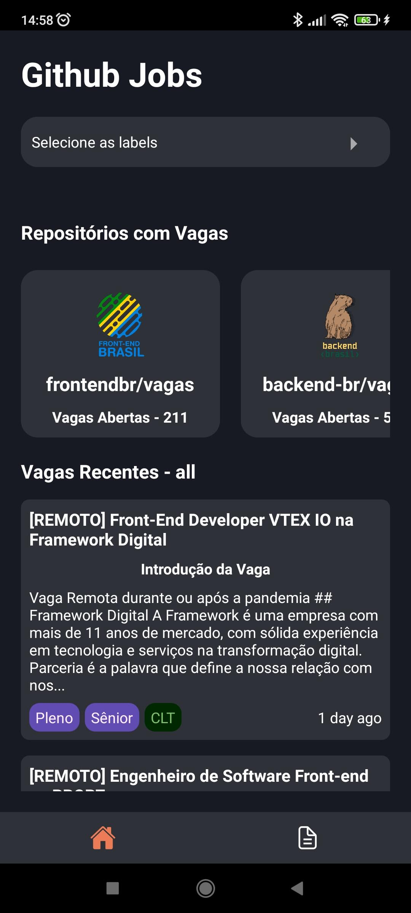
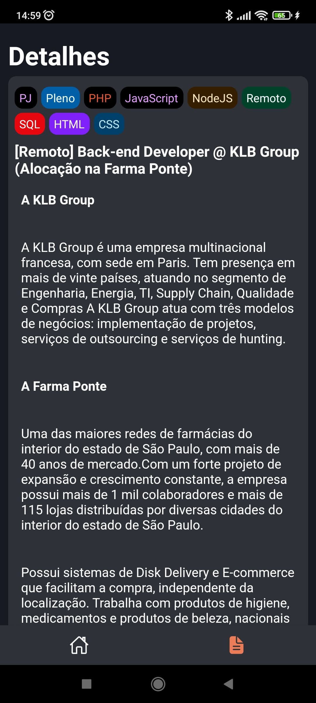
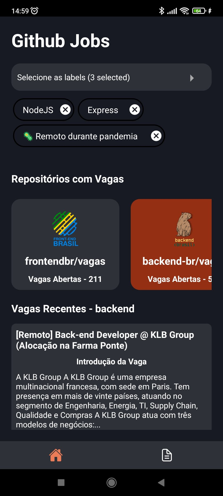

# GitHub Jobs App


<br/>
<br/>

# Screenshot

<div>
  
  
  
</div>

<br/>
<br/>

# Stacks & Tools

<p align="center">
    <a href="https://developer.mozilla.org/en-US/docs/Web/JavaScript" target="_blank">
      
    </a>
    <a href="https://www.typescriptlang.org/docs/" target="_blank">
      
    </a>
    <a href="https://reactnative.dev" target="_blank">
      
    </a>
    <a href="https://developer.android.com/studio" target="_blank">
      
    </a>
    <a href="https://github.com/toystars/react-native-multiple-select#readme" target="_blank">
      
    </a>
</p>

<br/>
<br/>

# Description

<p>
  GitHub Jobs App is a simple way to find a new Job into repositories at GitHub. Where you can find jobs to work as Front-end or Back-end Developer. 
</p>

<br/>
<br/>

# How to Install and Run 

**Dependecies**
  <ul>
    <li>Yarn or NPM</li>
    <li>NodeJS</li>
    <li>Android Studio Emulator, your device unlocked to install app or another emulator do you like</li>
  </ul>

<br />

Now clone this repo and run commands below:

```
 yarn install
```

or 

```
 npm install
```

After do you need install app where you'll simulate and test:

```
  yarn run react-native run-android
```

or 

```
  npm run react-native run-android
```

And finally run your app and make all changes that do you want at code and run: 

```
  yarn start
```

or 

```
  npm start
```

## OBS: Filter by label not implemented yet!.
